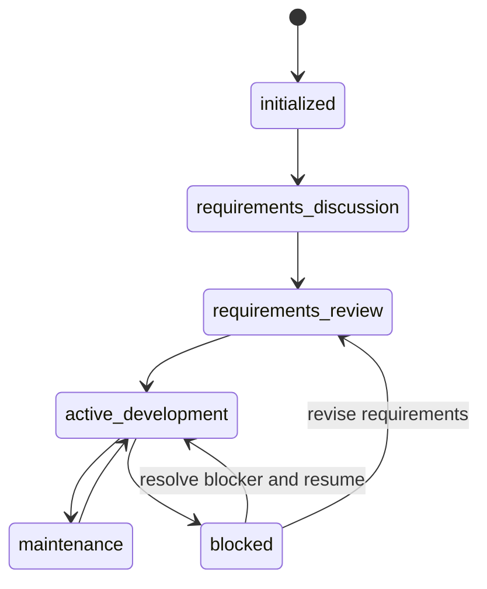

<!-- PGK_GENERATED: workflow -->
# Governance workflow

## Two-phase finalization

1. Complete all records, source files, tests, and documentation.
2. Run semantic checks while changes are uncommitted.
3. Fill final evidence and terminal statuses.
4. Commit the complete task branch once.
5. Run read-only clean-tree `pgk check` and `pgk doctor`.
6. Do not edit the repository after the clean-tree check. Store post-commit
   output in the external experiment report or handoff.
