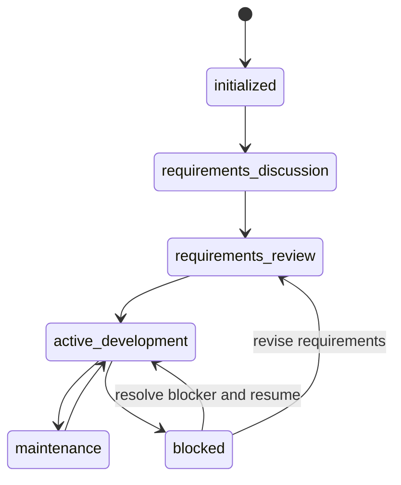

<!-- PGK_GENERATED: workflow -->
# Governance workflow

```mermaid
stateDiagram-v2
[*] --> initialized
initialized --> requirements_discussion
requirements_discussion --> requirements_review
requirements_review --> active_development
active_development --> maintenance
active_development --> blocked
maintenance --> active_development
blocked --> active_development: resolve blocker and resume
blocked --> requirements_review: revise requirements
```
