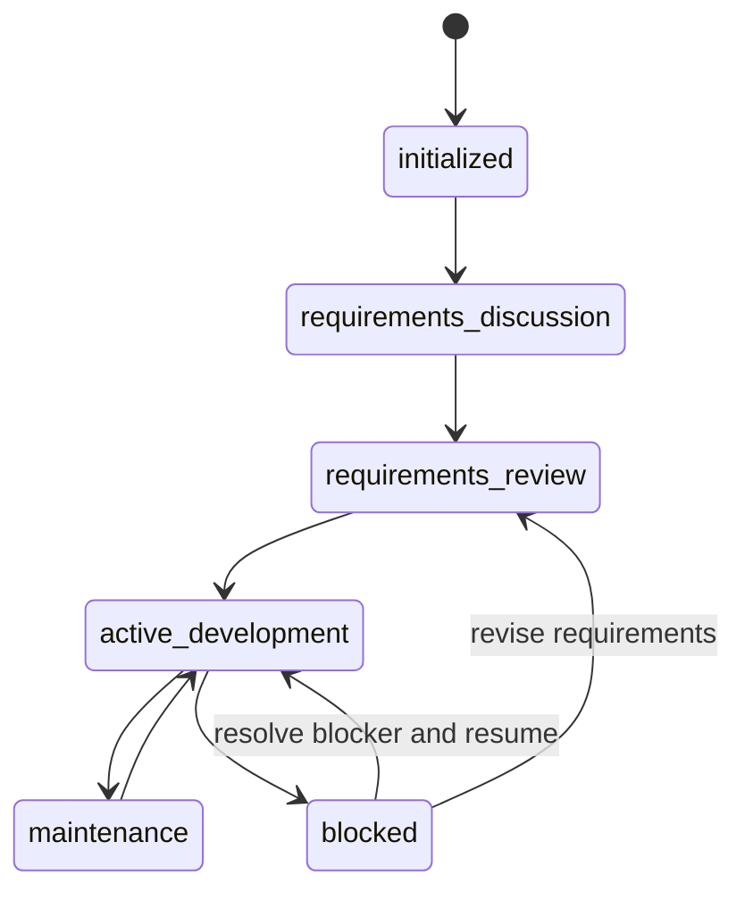

<!-- PGK_GENERATED: workflow -->
# Governance workflow

```mermaid
stateDiagram-v2
[*] --> initialized
initialized --> requirements_discussion
requirements_discussion --> requirements_review
requirements_review --> active_development
active_development --> maintenance
active_development --> blocked
maintenance --> active_development
blocked --> active_development: resolve blocker and resume
blocked --> requirements_review: revise requirements
```

## Record lifecycle

Use `pgk transition <ID> <status>` for formal status changes. Tasks and bugs
normally move through `draft/accepted -> in_progress -> in_review -> verified
-> done`; `blocked` returns to `in_progress`. A terminal transition requires
the deterministic terminal contract and reciprocal verification evidence.

## Two-phase finalization

1. Complete all records, source files, tests, and documentation. Synchronize
   STATUS, user-facing documentation, and version configuration with behavior.
2. Run semantic checks while changes are uncommitted.
3. Fill final evidence, set `head_commit: record-commit`, and apply terminal
   status with `pgk transition`.
4. Commit the complete task branch once; avoid transient commit/push claims in
   STATUS and terminal records.
5. Run read-only clean-tree `pgk check` and `pgk doctor`.
6. Do not edit the repository after the clean-tree check. Store post-commit
   output in the external experiment report or handoff.
