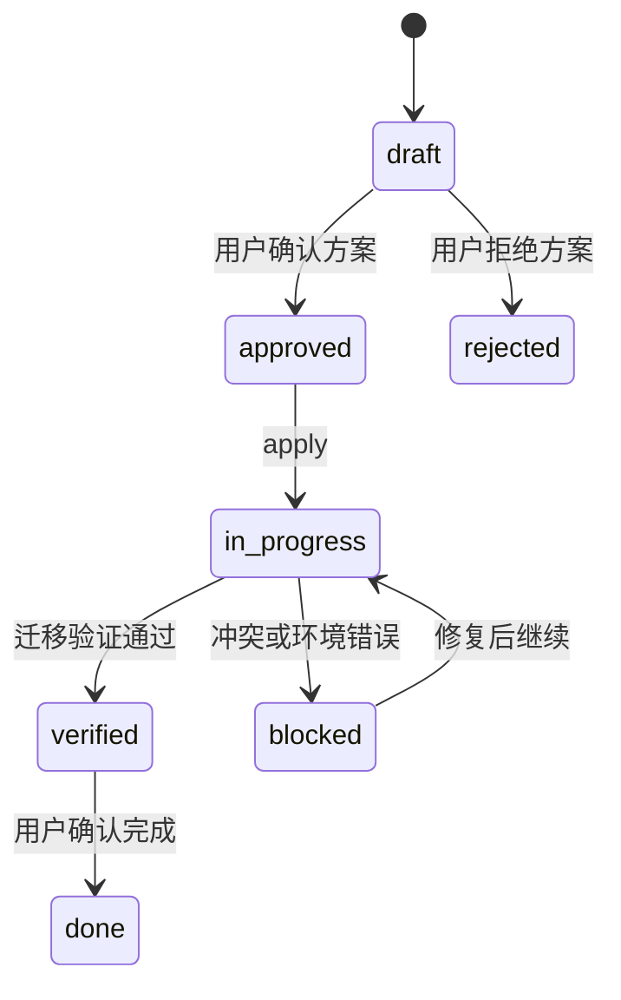

# Project Governance Kit v0.2 技术设计：已有项目接入与文档迁移

## 1. 设计目标和兼容性

在不破坏 v0.1 新项目初始化行为的前提下，增加已有项目的补齐和迁移能力。Kit 仍然是本地 Python 标准库工具，不调用模型或远程平台，不执行 Git 受保护动作。

补齐模式是安全的增量写入；迁移模式是“扫描—方案—批准—应用—验证”的文档驱动流程。

## 2. 组件边界

### 2.1 Adoption scanner

负责读取目录、识别 Git 状态、应用默认和用户配置的扫描/排除规则，并输出确定性候选项。扫描器只读取内容，不写目标项目。

### 2.2 Migration model

定义 `MIG-*` 批次、候选条目、来源元数据、目标记录、置信度和条目状态。模型负责校验 ID、路径、状态和哈希格式。

### 2.3 Migration planner

根据扫描候选生成迁移方案和 `MIG-*` 文档。规划器可以创建本地方案记录，但不得直接生成治理副本。

### 2.4 Migration applier

只读取已批准的 MIG 条目，执行目标目录创建和治理副本写入。应用器在写入前检查目标冲突、目标未提交修改和来源是否变化，并对每个条目独立记录结果。

### 2.5 Copy generator

对 Markdown/纯文本保留正文，只增加最小 YAML 元数据和来源说明。生成内容的业务状态固定为 `draft`，不得继承源文档中无法验证的“已确认”状态。

### 2.6 Governance checks

检查 MIG 是否被索引、来源是否存在、来源哈希是否匹配、目标副本是否存在、目标是否被人工修改、条目状态是否合法，以及迁移记录与活动/验证记录是否关联。

### 2.7 CLI

建议保留现有扁平命令风格并增加明确的迁移动作：

```text
pgk init --mode=supplement --root <project>
pgk adopt --root <project> --json
pgk migrate plan --root <project>
pgk migrate approve MIG-001 [--item <id> ...]
pgk migrate apply MIG-001 --root <project>
```

`adopt` 始终只读。`plan` 生成候选方案；`approve` 只改变 MIG 的批准状态；`apply` 只处理已批准条目。具体参数名称应遵循现有 CLI 的 `--root`、`--json` 和错误返回约定。

## 3. 文件布局

v0.2 标准 profile 新增：

```text
docs/
├── migrations/
│   └── INDEX.md
└── templates/
    └── migration.md
```

`MIG-*` 正文放在 `docs/migrations/`。治理副本仍放入 `docs/requirements/`、`docs/design/`、`docs/decisions/` 等标准目录。原文件不移动，来源通过相对路径记录。

## 4. MIG 记录结构

MIG frontmatter 至少包含：

```yaml
id: MIG-001
type: migration
status: draft
created: 2026-09-07
updated: 2026-09-07
related: []
mode: migrate
source_root: .
scan_roots: [docs]
exclude_patterns: [.git, .venv, node_modules]
approval: pending
```

正文以表格或固定区块保存条目。每个条目至少包含 source、source_hash、target、suggested_type、confidence、status、reason 和 result。记录还需要保存执行前后 Git 引用、工作区状态、blocker、evidence 和 next action。

## 5. 状态和流程



条目状态为 `candidate`、`approved`、`excluded`、`applied`、`needs_review`、`conflict`、`source_changed` 或 `failed`。不允许用批次状态代替条目结果。

## 6. 扫描和分类算法边界

扫描器只处理 UTF-8 可读的 Markdown 和纯文本。路径和文件名规则可以给出初始候选：`PRD`、`requirements` 倾向 `requirement`，`TSD`、`architecture`、`design` 倾向 `design`，`ADR` 倾向 `decision`，`bug`、`issue` 倾向 `bug`，`task`、`todo` 倾向 `task`。内容无法确认时降低置信度并标记 `needs_review`。

禁止从候选名称直接推导 `accepted`、`verified` 或 `done`。检测到密钥模式、证书内容、密码字段或明显账号配置时，条目标记为敏感并跳过复制。

## 7. 副本生成和幂等性

生成器以源文件字节计算 SHA-256，并将哈希写入治理副本。相同源路径和哈希对应同一迁移批次时跳过。目标存在、目标不匹配或目标有未提交修改时返回冲突，不覆盖。

源文件变化只更新 MIG 的检测结果，不自动更新治理副本。重复运行只发现新增候选和状态变化，不重复创建相同 ID 的记录。

### 7.1 Markdown 相对链接

治理副本改变了源文件所在目录，因此生成器对 Markdown 中的相对链接执行保守重写：

- 链接目标也被本批次迁移时，改写为目标治理副本的相对路径；
- 链接目标未迁移但仍存在于源项目时，改写为从治理副本指向源项目目标的相对路径；
- 外部 URL、锚点、绝对路径和不存在的目标保持原样；
- 原文件正文不修改；
- 重写结果仍保留在 `PGK_SOURCE_BEGIN/END` 区块内，供人工审查。

这样可以保持已知内部链接可解析，同时不伪造或猜测不存在的目标。

## 8. 错误隔离和恢复

单个文件读取、分类或写入失败不得回滚其他已成功条目。失败条目保存错误类别和安全摘要；不写入完整敏感内容或完整终端输出。后续 `apply` 可以只处理 `failed` 或新批准条目。

应用前如果目标路径与未提交修改重叠，阻止该条目；代码目录的其他脏修改不阻止迁移，但必须在 MIG 中记录。

## 9. 验证设计

测试分为：扫描边界、补齐保护、方案生成、批准门禁、副本生成、冲突/幂等、敏感内容排除、失败继续、索引和 `pgk check`。每项功能至少有单元测试；端到端 fixture 覆盖一个已有 Git 项目和一个非 Git 项目。

迁移验证必须检查：源文件仍存在、目标副本存在且带正确来源元数据、哈希一致、未批准项未写入、冲突未覆盖、MIG/索引/ACTIVITY/VER 关联完整。

## 10. 安全和回滚

迁移只新增或写入明确目标文件，不删除原文件。Git diff 是用户审查和回滚的主要手段。Kit 不保存原文快照，不读取或上传远程服务，不执行 commit、push、merge、PR 或 release。
